# Лабораторная работа №3: Первый контейнер


## Студентка: **Годорожа Оксана**, группа I2302

Дата выполнения: **25.02.2025**


## Цель работы

Данная лабораторная работа знакомит нас с основами контейнеризации и подготавливает рабочее место для выполнения следующих лабораторных работ.

### В первую очередь установим Docker

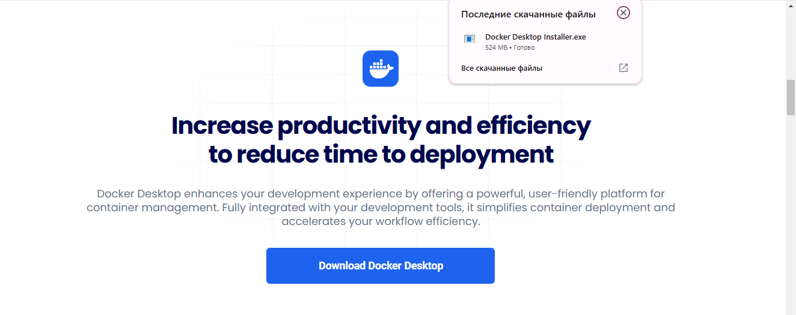
*Захожу на официальный сайт и скачиваю версию для Windows*

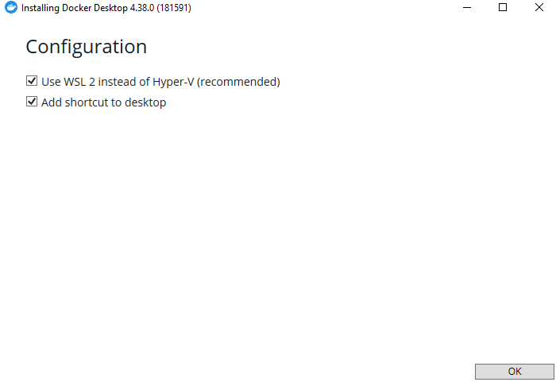
*Разрешаю все конфигурации перед установкой*

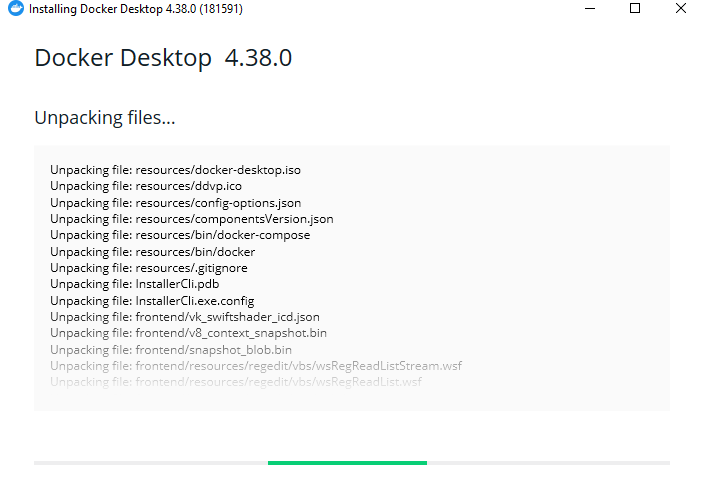
*Начинается распаковка файлов и сама установка*

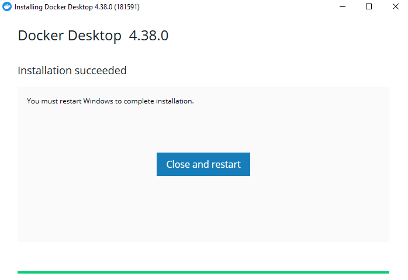
*После установки нас попросят перезагрузить систему*


*После соглашаемся и Docker установлен окончательно*

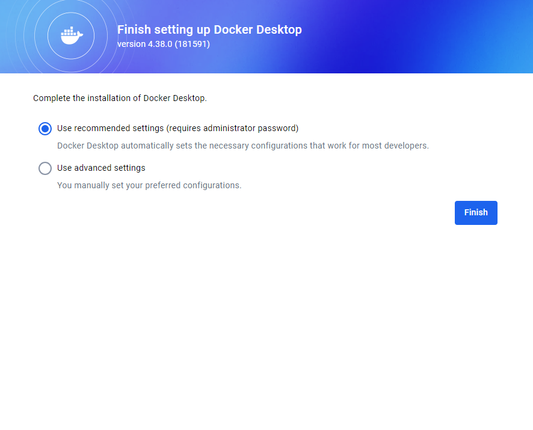
*Выбираем и используем рекомендованные настройки*

### Выполнение

1. Создала репозиторий containers02 и склонировала его себе на компьютер
    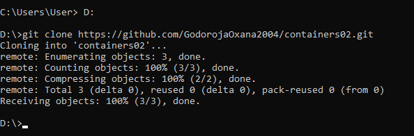

1. Создала в папке containers02 файл Dockerfile со следующим содержимым:

    ```docker 
    FROM debian:latest
    COPY ./site/ /var/www/html/
    CMD ["sh", "-c", "echo hello from $HOSTNAME"]
    ```
    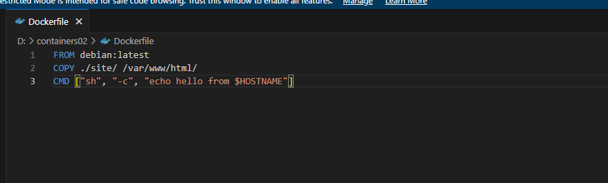

1.В той же папке проекта создала папку site. В новой папке создала файл index.html с произвольным содержимым.
    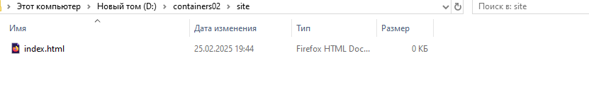
    *файл index.html*
    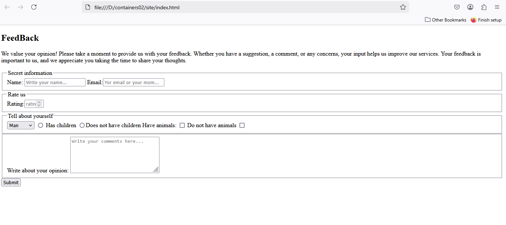
    *Произвольное содержимое*

### Запуск и тестирование

1. В папке **containers02** выполнила команду:

    ```sh
    docker build -t containers02 .
    ```
    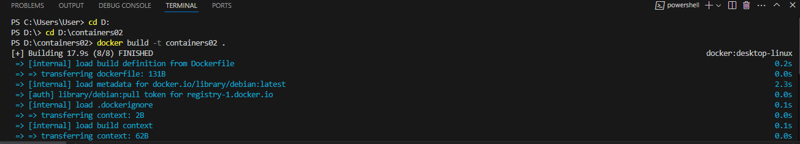
    Сколько времени создавался образ?
    **17.9 seconds**

1. Выполнила команду для запуска контейнера:

    ```sh
    docker run --name containers02 containers02
    ```

    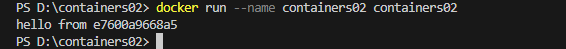

    Что было выведено в консоли? 
    
    Вывело индефикатор ID Docker образ имеет хэш из 12 символов: **hello from e7600a9668a5**  

1. Удалила контейнер и запустила снова, выполнив команды:
    ```sh
    docker rm containers02
    docker run -ti --name containers02 containers02 bash
    ```
    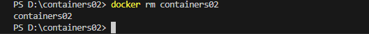
    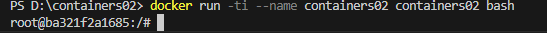

1. В открывшемся окне выполнила команды:
    ```sh
    cd /var/www/html/
    ls -l
    ```
    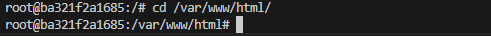
    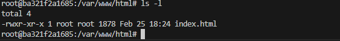
    Что выводится на экране?
    Я подозреваю что вывело размер всех файлов в директории: **total 4** 


## Выводы:

Я установила Docker Desktop, создала образ и запустила контейнер, что подтверждает его работоспособность. Сделали первые шаги для понимая того как создавать в первую очередь контейнер. А самое главное проложили путь к основам контейнеризации.

## Используемые источники:
[Официальный сайт Docker](https://www.docker.com/products/docker-desktop/)

[Markdown гайд](https://www.markdownguide.org/)

[Работа с Git](https://git-scm.com/book/ru/v2)
